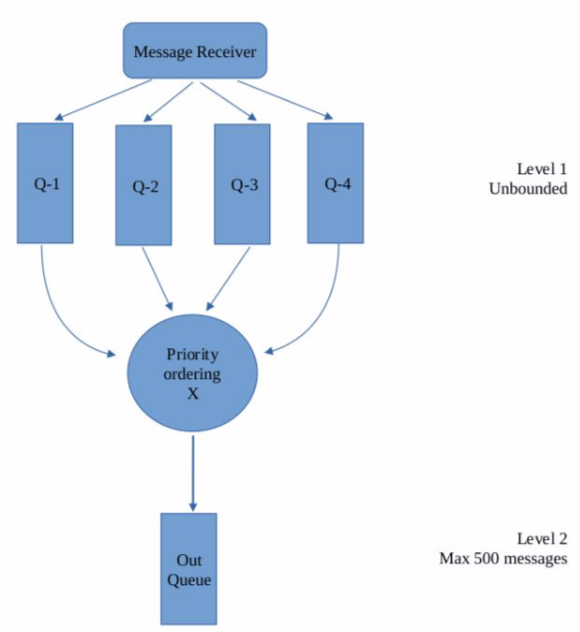
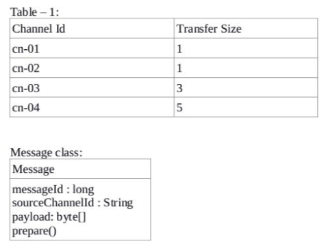

# Message Processing System

The repository implements an in-memory high-throughput priority-based messaging system in Java 8

## Problem Statement

Your team is expected to work on a message processing system, where messages are received on multiple 
channels and should be processed according to the priority of the channel. You’re working on the 
module which queues and orders the messages arriving at the system.

Following block diagram shows the overview of message ordering module





### Details and constraints:

- Primary goals of this module is to deliver prepared messages to processing module as soon as 
possible (to maintain a high Transactions Per Second across the whole system) with the correct 
channel priority and to queue messages handling unequal in/out rates.

- A MessageHandler instance should be registered to receive messages using 
`ChannelListener.getInstance().registerMessageHandler(MessageHandler)`​ method. Make sure all the 
module initialization is done before calling the above method as it will start the message flow. 
Note that these methods should not be blocking, must return as soon as possible for the channel 
listener to be functional.

```java
public interface MessageHandler { 
	messageReceived(Message m);
	channelCreated(String channelId); 
	channelDestroyed(String channelId);
}
```

- You are expected to implement the following interface, so the Message Processing module will call 
getQueue() method to obtain a reference of the out queue. (i.e. OrderingSystem.getQueue() )

```java
public interface OrderedMessageQueueProvider {
	java.util.Queue<Message> getQueue();
}
```

- Out queue size is limited due to an external reason (Level 2). Because of this, messages received
 are expected to be queued before they are ordered(Level 1). As shown in the diagram, one queue per 
 source channel is suggested. Source channel can be identified from the sourceChannelId field of a 
 Message object. If the out queue is full, message transfer should be paused until there is free 
 space in the output queue. Source channels can be added or removed while the module is running 
 (Refer MessageHandler). Note that the channel listener will invoke channelCreated() before 
 dispatching messages from this channel.

- There is a preparation to be done on each message before processing. Assume this is implemented in 
the Message class in `prepare()` method. This method can take up to half a second to return. Find the 
best way to invoke this method at any stage of message flow. Make sure the preparation is done before 
the processing module dequeue messages.

- To enforce the priority of Queues, different quantities of messages (Transfer size) are taken from 
each queue at a time to be transferred to the out queue for processing. Assume that the Table-1 has 
already been loaded to memory from a database with all possible channel ids. Transfer size is an 
integer in the range 1 – 10 inclusive. Number of channels are expected to grow more than 150.

- `messageReceived()` method will be invoked by threads in an external thread pool. Messages stored 
in the out queue will be taken by threads from another external thread pool. Ordering module has to 
be thread safe with minimum blocking possible.


## Classes

The **MessageHandler** exposes the required interfaces to interact with the messaging system - for pushing messages and managing channels.
The **OrderedQueueService** serves as the heart of the messaging system and implements the core logic around the creation/deletion of Channels and handling message inflow and outflow.
The **QueueMessageConsumer** is used internally for listening to messages from the internal channel queues, preparing them and pushing them into the outbox queue.

## Flow

### Channel Creation
The **PriorityMessageHandler** delegates the channel creation command to the OrderedQueueService. 
The **PriorityOrderedQueueService** implementation of the OrderedQueueService maintains an internal map of `channelId` to `Queue<Message>`. 
A LinkedBlockingQueue is used for maintaining the messages since it's unbounded and provides thread-safe operations.
For every new channel, a new Queue is created and added to the Map and along with a set of QueryMessageConsumer threads are initialized to operate on this queue.

### Channel Deletion
The **PriorityMessageHandler** delegates the channel deletion command to the OrderedQueueService. 
The **PriorityOrderedQueueService** removes the channelId entry from its internal map and stops all the QueryMessageConsumers working on the queue associated with this channel.

### Channel Message Received
The **PriorityMessageHandler** delegates the message push command to the OrderedQueueService.
The **PriorityOrderedQueueService** inserts the message into the respective queue associated with the channel and signals the QueryMessageConsumer listening on the queue about the availability of the message.

## Design Decisions

* The **PriorityOrderedQueueService** uses `ReadWriteLock` to manage synchronization among push, channel deletion and creation operations.
* **Semaphore** is used by QueryMessageConsumer to signal when the required (transfer size) amount of messages is available so that the thread can be unblocked for message consumption.
* `put` operation is preferred for the outbox queue since it's required for the QueryMessageConsumer to be blocked when the outbox queue is full.

The PriorityOrderedQueueService on receiving a message first inserts the message into the respective queue for the channel and then signals the QueryMessageConsumer (QMC) about the availability of the message which internally just increments the semaphore. Every QMC thread is blocked until it can acquire claims equal to the transfer size for the channel. Once the channel queue has sufficient messages the QMC thread can acquire the semaphore lock and proceeds to take the messages from the channel queue. It then calls the prepare() method on the message before making a blocking call to place this message into the Outbox queue. Since the prepare() method might take a while to execute and blocks the QMC thread meanwhile, we decided to use a group of QMC threads for every internal channel queue.

## Simulator

A simulator program is provided to test the implementation of the messaging system using randomized data. It uses a pool for message producers and message consumers which interacts with the messaging system as a whole and is configurable.

Sample Output
```text
Channel created: cn-01
Message enqueued: Message(id=5115374033600992628, sourceChannelId=cn-01, payload=����X��{ZN���)
Channel created: cn-02
Message enqueued: Message(id=6810218739369952513, sourceChannelId=cn-02, payload=����^^􉔃��̳Y�d�)
Message processed: Message(id=5115374033600992628, sourceChannelId=cn-01, payload=����X��{ZN���)
Message enqueued: Message(id=1049515144721234004, sourceChannelId=cn-01, payload=�)
Message processed: Message(id=6810218739369952513, sourceChannelId=cn-02, payload=����^^􉔃��̳Y�d�)
Channel created: cn-03
Message enqueued: Message(id=657627094127186932, sourceChannelId=cn-03, payload=)
Message enqueued: Message(id=7989637598263088833, sourceChannelId=cn-02, payload=/�r.)
Message enqueued: Message(id=1103883357126701102, sourceChannelId=cn-02, payload=���ȏ�ê�݀}�"��)
Message processed: Message(id=1049515144721234004, sourceChannelId=cn-01, payload=�)
Channel created: cn-04
Message enqueued: Message(id=2148432114271410001, sourceChannelId=cn-04, payload=��{'�P�)
Message processed: Message(id=1103883357126701102, sourceChannelId=cn-02, payload=���ȏ�ê�݀}�"��)
Message enqueued: Message(id=6876384631712837910, sourceChannelId=cn-04, payload=Z#.)
Message enqueued: Message(id=745049232036055115, sourceChannelId=cn-04, payload=Bp8�i�L)
Channel destroyed: cn-04
Message enqueued: Message(id=1732526319845368791, sourceChannelId=cn-04, payload=�|�It�L?~)
Message enqueued: Message(id=5917777655313112374, sourceChannelId=cn-03, payload=5T����7*�)
Message enqueued: Message(id=1937614905576936265, sourceChannelId=cn-01, payload=�z����)
Message processed: Message(id=2148432114271410001, sourceChannelId=cn-04, payload=��{'�P�)
```

